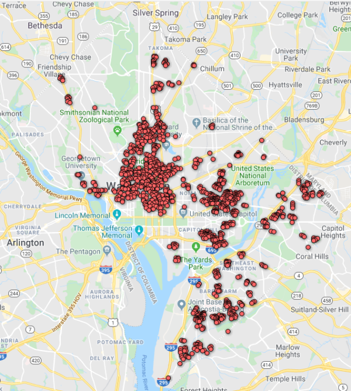

### locaw-dbscan
Simple implementation of DBSCAN (Density-based spatial clustering of applications with noise) algorithm for Location Awareness course back in 2016.

##### Usage:
```
$ python3 dbscan.py [-h] [-v] -i INPUT [-o OUTPUT] [-y LATITUDE] [-x LONGITUDE]
                 -e EPSILON -m MIN_PTS -k KNN_LIMIT
```

Original data\


Output from:\
$ python3 dbscan.py -i resources/incidents_2010.csv -y 0 -x 1 -e 100 -m 20 -k 50\


Output from:\
$ python3 dbscan.py -i resources/incidents_2010.csv -y 0 -x 1 -e 100 -m 25 -k 50\

